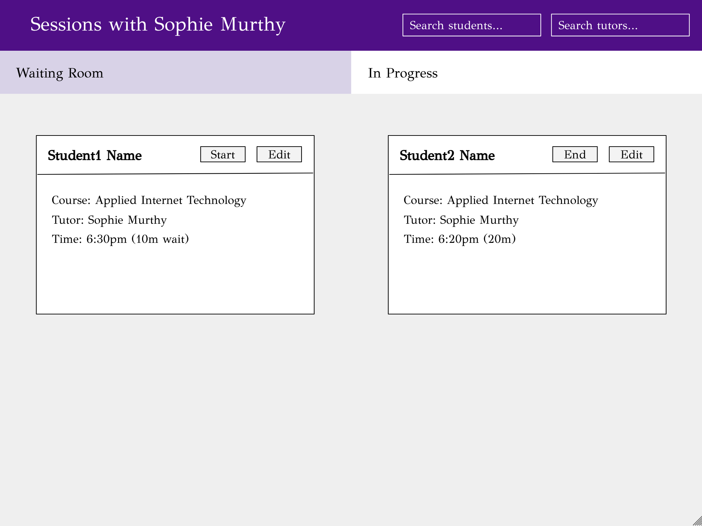
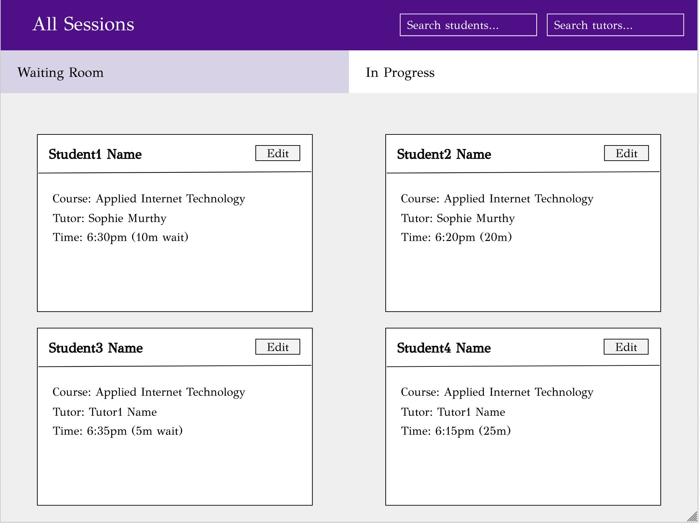

# Tutoring Session Manager for ULC

## Overview


The NYU University Learning Center (ULC) is a drop-in based tutoring service through NYU CAS that offers peer tutoring for a multitude of classes. Currently, the ULC uses software through NYU Connect, which is a meeting-based scheduling software that is not well equipped to handle drop-in based tutoring sessions.

This tutoring session manager is a web app that will keep track of all current, waiting, and finished tutoring sessions. The system has information about all of the tutors, all of the courses they tutor, and their current schedule. The system will be able to pair a student with a tutor, begin a session, keep track of the timing of the session and other relevant details, and provide the tutor with an evaluation form to fill out about the student after the session. The system will also be able to keep track of a waitlist when all available tutors are in sessions, and will allow users to move students from the waitlist into a current session. 


## Data Model

The application will store tutors, admins, students, sessions (current, pending, and completed), and courses (potentially).

* tutors can have multiple courses (via references)
* students can have multiple courses (via references)
* sessions can have one tutor and multiple students (via references) as well as one course (via reference)
* sessions can also have an evaluation object (via embedding)

* admins can see all sessions
* tutors can only access their own sessions

An Example Tutor:

```javascript
{
  firstname: 'Sophie',
  lastname: 'Murthy',
  username: "sophiemurthy",
  hash: // a password hash,
  course: // an array of references to Course documents the tutor teaches,
  hours: // an array of the hours a tutor teaches
}
```

An Example Admin:

```javascript
{
  firstname: 'Admin',
  lastname: 'LastName',
  username: "adminuser",
  hash: // a password hash,
}
```

An Example Student:

```javascript
{
  firstname: 'Student',
  lastname: 'Person',
  username: "studentusername",
  hash: // a password hash,
  course: // an array of references to Course documents the student takes,
}
```

An Example Session:

```javascript
{
  course: // a reference to a Course document
  tutor: // a reference to a Tutor document
  students: // an array of reference to Student documents
  start: // the date and time the session began
  end: // the date and time the session ended
  status: "Completed", // can be pending or in progress as well
  location: "ULC ARC",
  evaluation: {prepared: True}
}
```

An Example Course:

```javascript
{
  title: "Applied Internet Technology",
  professor: "Joe Versoza"
}
```


## [Link to Commented First Draft Schema](db.mjs) 

(__TODO__: create a first draft of your Schemas in db.mjs and link to it)


## Wireframes

/admin - general main page for admins



/tutor - main page for tutors



/edit - page for editing a student


/login - login page for all users


/register - registration page for users


/end - page for ending a session


## Site map


## User Stories or Use Cases

1. as non-registered user, I can register a new account with the site
2. as a user, I can log in to the site
3. as a user, I can edit my profile
4. as an admin, I can register new tutors and new students 
5. as an admin, I can view and edit all sessions (in progress, pending, and completed)
6. as a tutor, I can add new sessions and view all of my sessions (in progress, pending, and completed)
7. as a tutor, I can end and evaluate sessions 
8. as a tutor, I can edit my sessions 
9. as a student, I can register for a session

## Research Topics

(__TODO__: the research topics that you're planning on working on along with their point values... and the total points of research topics listed)

* (5 points) Integrate user authentication
    * I'm going to be using passport for user authentication
    * And account has been made for testing; I'll email you the password
    * see <code>cs.nyu.edu/~jversoza/ait-final/register</code> for register page
    * see <code>cs.nyu.edu/~jversoza/ait-final/login</code> for login page
* (4 points) Perform client side form validation using a JavaScript library
    * see <code>cs.nyu.edu/~jversoza/ait-final/my-form</code>
    * if you put in a number that's greater than 5, an error message will appear in the dom
* (5 points) vue.js
    * used vue.js as the frontend framework; it's a challenging library to learn, so I've assigned it 5 points

10 points total out of 8 required points (___TODO__: addtional points will __not__ count for extra credit)


## [Link to Initial Main Project File](app.mjs) 


## Annotations / References Used


