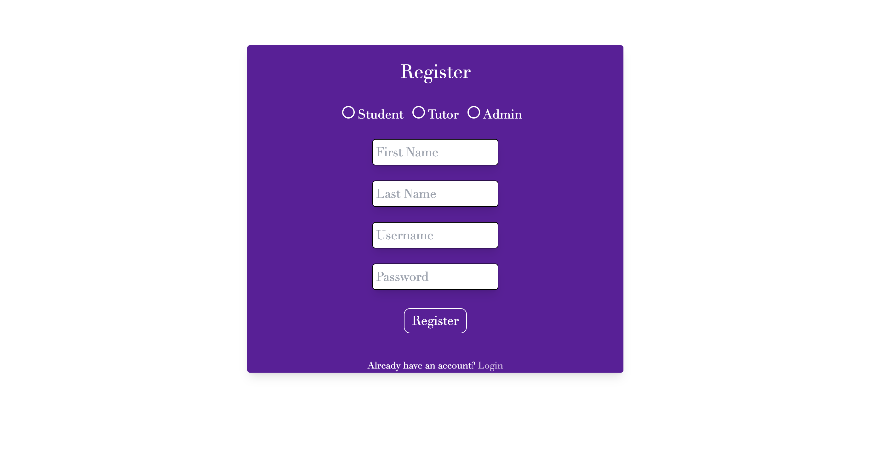
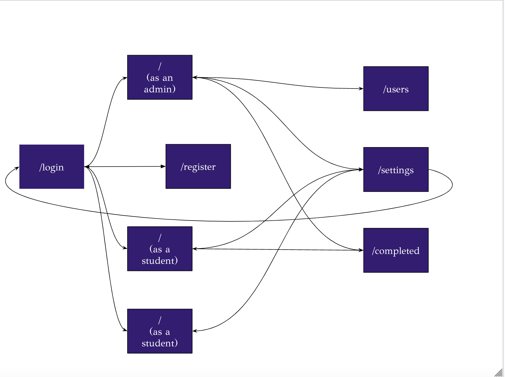

# Tutoring Session Manager for ULC

## Overview


The NYU University Learning Center (ULC) is a drop-in based tutoring service through NYU CAS that offers peer tutoring for a multitude of classes. Currently, the ULC uses software through NYU Connect, which is a meeting-based scheduling software that is not well equipped to handle drop-in based tutoring sessions.

This tutoring session manager is a web app that will keep track of all current, waiting, and finished tutoring sessions. The system has information about all of the tutors, and all of the courses they tutor. The system will be able to pair a student with a tutor, begin a session, keep track of the timing of the session and other relevant details, and provide the tutor with an evaluation form to fill out about the student after the session. The system will also be able to keep track of a waitlist when all available tutors are in sessions, and will allow users to move students from the waitlist into a current session. 


## Data Model

The application will store tutors, admins, students, sessions (current, pending, and completed), and courses.

* tutors can have multiple courses (via references)
* students can have multiple courses (via references)
* sessions can have one tutor and one student (via references) as well as one course (via reference)
* sessions can also have an evaluation object (via embedding)

* admins can see all sessions
* tutors can only access their own sessions

An Example Tutor:

```javascript
{
  firstname: 'Sophie',
  lastname: 'Murthy',
  username: "sophiemurthy",
  password: // a password hash,
  course: // an array of references to Course documents the tutor teaches,
  hours: // an array of the hours a tutor teaches
}
```

An Example Admin:

```javascript
{
  firstname: 'Admin',
  lastname: 'LastName',
  username: "adminuser",
  password: // a password hash,
}
```

An Example Student:

```javascript
{
  firstname: 'Student',
  lastname: 'Person',
  username: "studentusername",
  password: // a password hash,
  courses: // an array of references to Course documents the student takes,
}
```

An Example Session:

```javascript
{
  course: // a reference to a Course document
  tutor: // a reference to a Tutor document
  students: // an array of reference to Student documents
  start: // the date and time the session began
  end: // the date and time the session ended
  status: "Completed", // can be pending or in progress as well
  location: "ULC ARC",
  evaluation: {prepared: True, notes: "good student"}
}
```

An Example Course:

```javascript
{
  title: "Applied Internet Technology",
  professor: "Joe Versoza"
}
```


## [Link to Commented First Draft Schema](db.mjs) 


## Wireframes

/ - general main page 
(different if logged in as admin, tutor, or student)


/settings - page for editing a user's profile


/users - page for viewing all users in admin view


/login - login page for all users


/register - registration page for users



/edit - page for editing a student


/end - page for ending a session


## Site map




## User Stories or Use Cases

1. as non-registered user, I can register a new account with the site
2. as a user, I can log in to the site 
3. as an admin, I can see all student and tutor users
4. as an admin, I can view all sessions (in progress, pending, and completed)
5. as an admin, I can edit pending sessions
6. as a tutor, I can start new sessions and view all of my sessions (in progress, pending, and completed)
7. as a tutor, I can end and evaluate sessions 
8. as a tutor, I can edit my sessions 
9. as a student, I can request a session for a course I am taking

## Research Topics

* (2 points) Use a CSS framework or UI toolkit
    * I'm planning on using Tailwind CSS for styling my site
    * Tailwind is a CSS framework that provides utility classes to help with design
    * I can create a theme for the site and use it to style the site without the limitations of standard CSSS
    * I could potentially used Tailwind UI to help with the design of the site using the components and templates
* (4 points) Use a server side JavaScript library or module
    * I'm going to be using passport.js for user authentication
    * Passport.js is a middleware that provides authentication for Node.js
    * I can use it to authenticate users logging into the site and prevent unauthorized access
    * I could potentially use passport-local to authenticate users using a username and password or passport-google-oauth20 to authenticate users using their Google account
    * I have never used this before, so I've assigned it 4 points
* (5 points) Automated functional testing for all routes
    * I will use Headless Chrome to test all of my routes
    * Headless Chrome is a version of the Chrome browser that can run without a user interface, so I can test my routes in a browser environment
    * I can use it to test all of my routes to make sure they are working properly

## [Link to Headless Chrome Testing Clip](headless chrome testing.mov)


## [Link to Initial Main Project File](app.mjs) 


## Annotations / References Used


